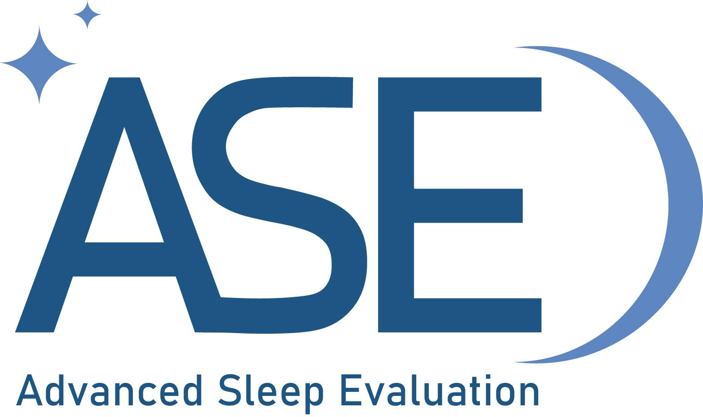
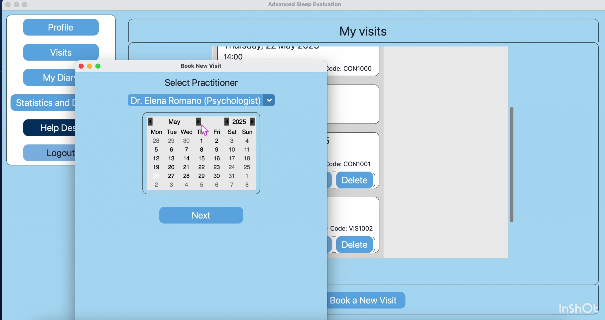
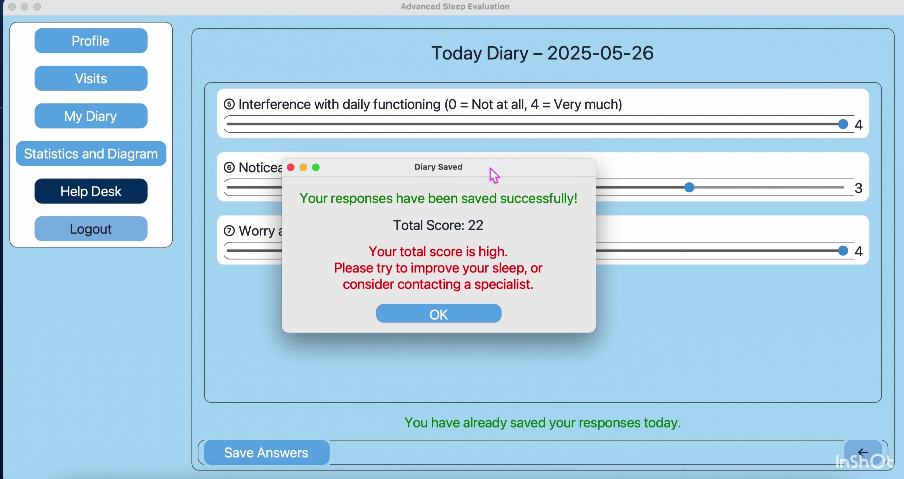
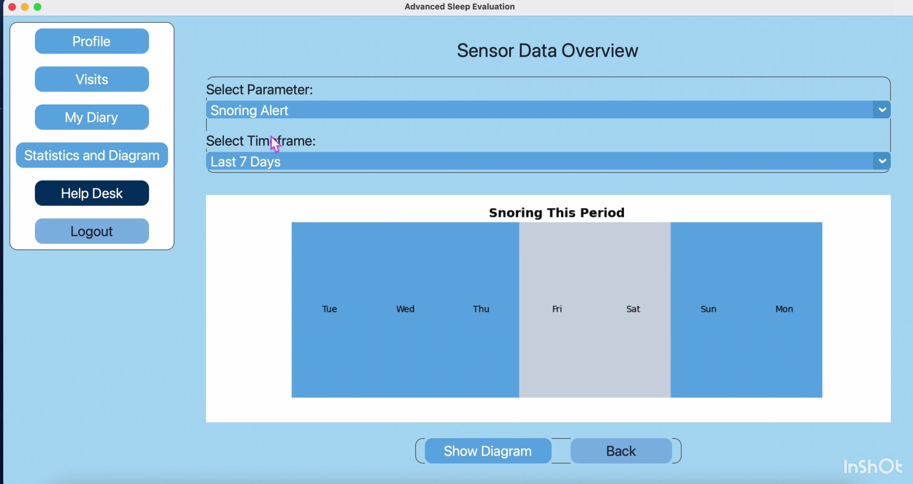
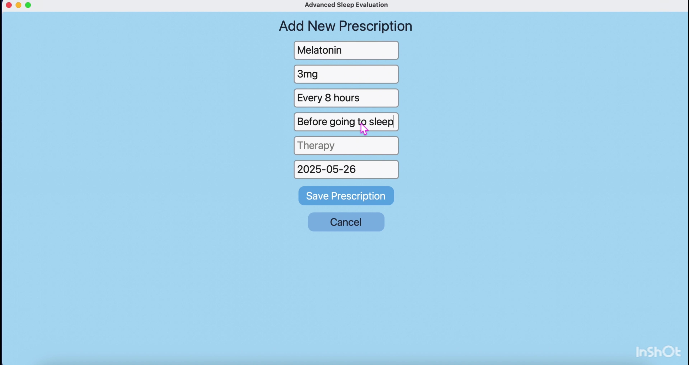
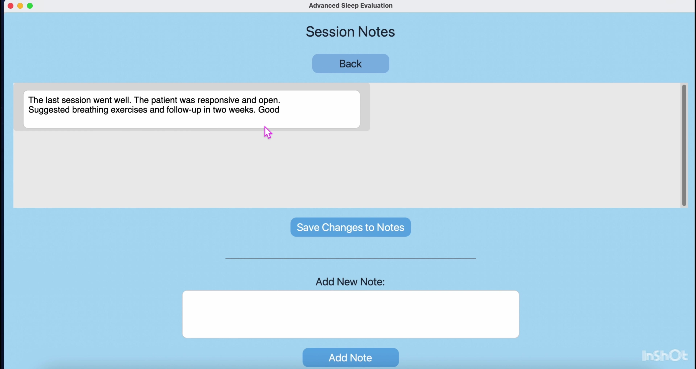
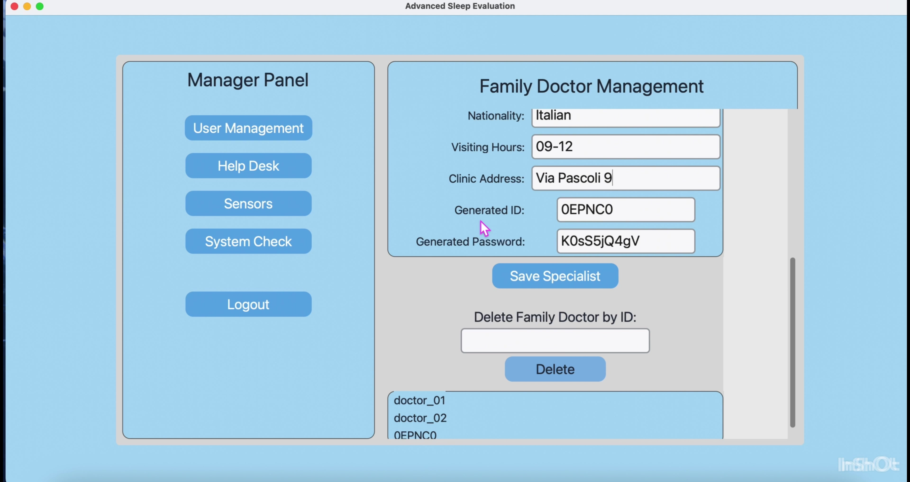

# Advanced Sleep Evaluation (ASE)

<p align="center">
  
</p>

Python desktop application developed as an academic medical-informatics group project prototype for the management of sleep-disorder care pathways.

The project integrates role-based graphical interfaces, local relational data management, patient self-management tools, appointment scheduling, digital sleep diaries, prescription management, physiological and sleep-data visualization, and administrative functions.

> **Academic prototype and simulated data:** this application was developed exclusively for academic, demonstration, and educational purposes. **All data included in this repository are entirely simulated and do not refer to real individuals.** This includes user profiles, names, identifiers, login credentials, appointments, clinical information, prescriptions, sleep-diary entries, physiological measurements, and sleep data. No real patient data, personal data, or sensitive health information are included. This software is not a medical device and is not intended for diagnosis, treatment, or clinical decision-making.

## Application preview

<table>
  <tr>
    <td align="center"><b>Patient appointment booking</b></td>
    <td align="center"><b>Digital sleep diary</b></td>
  </tr>
  <tr>
    <td></td>
    <td></td>
  </tr>
  <tr>
    <td align="center"><b>Sleep and physiological data visualization</b></td>
    <td align="center"><b>Prescription management</b></td>
  </tr>
  <tr>
    <td></td>
    <td></td>
  </tr>
  <tr>
    <td align="center"><b>Psychologist session notes</b></td>
    <td align="center"><b>Application manager interface</b></td>
  </tr>
  <tr>
    <td></td>
    <td></td>
  </tr>
</table>


## Application roles

### Patient

The patient interface supports the self-management components of the sleep-care pathway.

Main functionalities include:

- credential-based authentication and password reset;
- personal profile visualization and editing;
- booking, modification, and cancellation of medical visits and psychological consultations;
- digital sleep-diary completion;
- visualization of simulated sleep and physiological data;
- analysis over one night, the last 7 days, the last month, or the last 6 months;
- help-desk messaging.

### Sleep specialist / doctor

The specialist interface provides tools for patient follow-up and sleep-data review.

Main functionalities include:

- role-based authentication and profile management;
- patient lookup by patient identifier;
- review of sleep-diary scores;
- visualization of sleep and physiological parameters;
- prescription creation, editing, and deletion;
- weekly appointment-calendar management.

### Psychologist

The psychologist interface supports the psychological component of the patient pathway.

Main functionalities include:

- role-based authentication and profile management;
- patient lookup and consultation overview;
- review of sleep-diary scores;
- session-note management interface;
- weekly consultation-calendar visualization.

### Application manager

The manager interface supports the administrative organization of the prototype.

Main functionalities include:

- manager access;
- patient and healthcare-professional management;
- sensor inventory management;
- patient-sensor association management;
- help-desk message handling;
- demonstration system-status visualization.

## Sleep and physiological data visualization

The application visualizes simulated sleep data stored at nightly and minute-level resolution.

Available parameters include:

- total sleep time;
- sleep and wake percentages;
- sleep-stage distribution;
- heart rate;
- respiratory rate;
- SpO2;
- snoring alerts;
- skin temperature.

Plots are generated with Matplotlib and can be displayed for a single night or aggregated over longer observation periods.

## Data layer

The prototype uses four local SQLite databases stored in the `data/` directory:

- `data/insomnia_management.db` — users, roles, personal information, patients, doctors, psychologists, visits, consultations, prescriptions, sensors, and sensor associations;
- `data/sleep_data.db` — nightly sleep summaries and minute-level physiological data;
- `data/diary_responses.db` — sleep-diary responses and scores;
- `data/helpdesk.db` — help-desk messages.

The databases contain **fully synthetic demonstration data** created solely to reproduce the application's interfaces, workflows, and visualizations. All identities, credentials, appointments, clinical records, diary responses, and physiological or sleep measurements are fictional.

## Repository structure

The repository separates the active source code from synthetic data, graphical resources, experimental prototypes, and earlier development material.

```text
mi_sleepDisordersManagementApp_project/
├── src/
│   ├── main.py
│   └── ui/
│       ├── __init__.py
│       ├── database_controller.py
│       ├── login_manager.py
│       ├── login_page.py
│       ├── login_patient.py
│       ├── login_selector.py
│       ├── main_window.py
│       ├── style_ctk.py
│       ├── manager/
│       │   └── appmanager.py
│       ├── patient/
│       │   └── patient.py
│       ├── specialist/
│       │   ├── __init__.py
│       │   ├── calendar_page.py
│       │   ├── diary_page.py
│       │   ├── home_page.py
│       │   ├── patient_page.py
│       │   ├── prescription_page.py
│       │   ├── profile_page.py
│       │   └── sensor_data_page.py
│       └── psychologist/
│           ├── calendar_page.py
│           ├── diary_page.py
│           ├── home_page.py
│           ├── note_page.py
│           ├── patient_page.py
│           └── profile_page.py
├── data/
│   ├── diary_responses.db
│   ├── helpdesk.db
│   ├── insomnia_management.db
│   └── sleep_data.db
├── assets/
│   ├── PHOTO-2025-05-20-00-09-20.jpg
│   └── sleep_graph_example.png
├── prototypes/
│   ├── face_id_prototype.py
│   └── requirements-faceid.txt
├── archive/
├── .gitattributes
├── .gitignore
├── README.md
└── requirements.txt
```

### Repository organization

`src/` contains the current multi-role desktop application. The main application entry point is `src/main.py`. Shared authentication, database-access, navigation, and interface components are organized under `src/ui/`, while role-specific functionalities are separated into `patient/`, `specialist/`, `psychologist/`, and `manager/` modules.

`data/` contains the SQLite databases used by the prototype. All records are fully synthetic and are included only to reproduce the application's workflows and data visualizations.

`assets/` contains graphical resources used by the project, including the ASE logo and an example sleep-data visualization.

`prototypes/` contains experimental developments that are not part of the active application workflow. The Face ID prototype is retained separately together with its additional dependency file.

`archive/` preserves earlier exploratory scripts and preliminary implementations developed during the evolution of the project. These files document the development process but are not required by the current application.

This organization keeps the active source code clearly separated from data resources, graphical assets, experimental features, and legacy development material.

## Installation

### 1. Clone the repository

```bash
git clone https://github.com/AnnaCarazzaGit/mi_sleepDisordersManagementApp_project.git
cd mi_sleepDisordersManagementApp_project
```

### 2. Create and activate a virtual environment

macOS / Linux:

```bash
python3 -m venv .venv
source .venv/bin/activate
```

Windows:

```bash
python -m venv .venv
.venv\Scripts\activate
```

### 3. Install the dependencies

```bash
python -m pip install --upgrade pip
python -m pip install -r requirements.txt
```

Tkinter must also be available in the local Python installation because the graphical interface is built on Tk and CustomTkinter.

## Running the application

From the repository root, run:

```bash
python src/main.py
```

The main entry point initializes the Advanced Sleep Evaluation graphical interface and provides access to the different role-based login workflows.

## Experimental Face ID prototype

An experimental Face ID implementation is retained in `prototypes/`.

It is **not part of the active application workflow** and should be considered a separate proof-of-concept module. Its additional dependencies are listed in:

```text
prototypes/requirements-faceid.txt
```

## Technology stack

- Python
- CustomTkinter / Tkinter
- SQLite
- NumPy
- pandas
- Matplotlib
- Tkcalendar
- Pillow

The experimental Face ID prototype additionally explores OpenCV, `face_recognition`, and `dlib`.

## Current limitations

- The project is an academic desktop prototype rather than a production clinical system.
- Authentication is implemented locally and is not designed for production deployment.
- All user, clinical, physiological, and sleep-related data are simulated and included solely for demonstration purposes.
- The manager system-status interface is a graphical demonstration and does not perform real infrastructure monitoring.
- Some prototype functions are implemented locally and do not use a remote healthcare information system.
- The Face ID implementation is an experimental proof of concept and is not part of the current application workflow.
- The application has not undergone clinical, cybersecurity, or usability validation for real-world medical deployment.

## Academic context

This repository demonstrates the design and development of a multi-role medical-informatics application integrating graphical user interfaces, relational data management, healthcare workflow logic, and physiological-data visualization in the context of sleep-disorder management.
